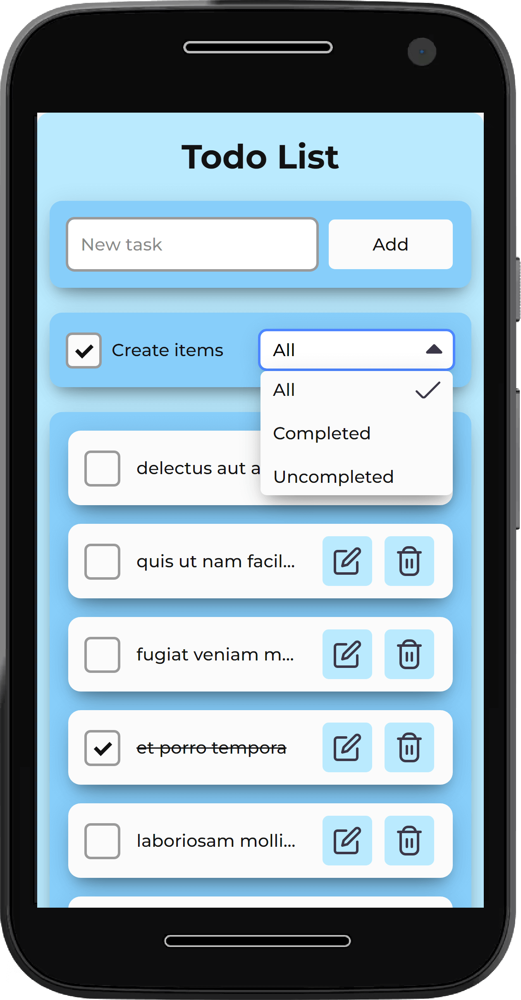
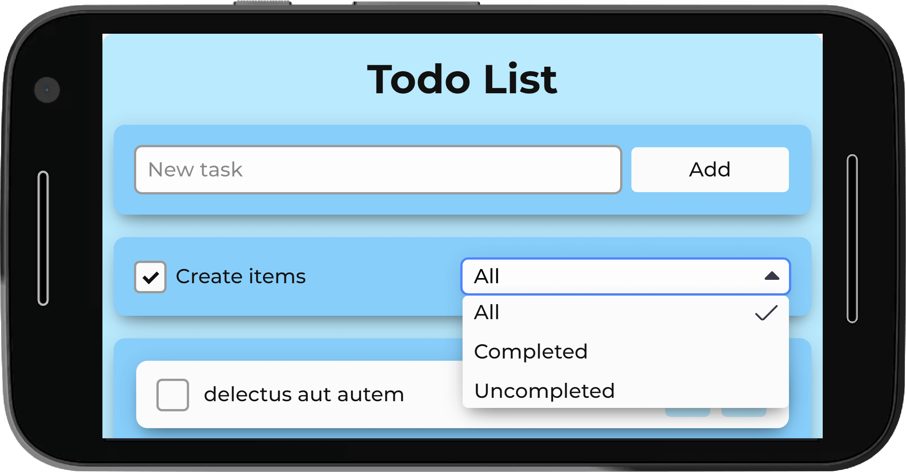

# React Todo List

## Description

A simple todo list implemented using React.

  
  

## Project page

https://kateworks.github.io/react-todo-list

Initial data: https://my-json-server.typicode.com/kateworks/data/todos

## Technologies

* [Create React App](https://github.com/facebook/create-react-app).
* [{JSON} Placeholder](https://jsonplaceholder.typicode.com/)
* [ESLint](https://eslint.org/)
* [Stylelint](https://stylelint.io/)

## Installation

### Get the copy

`git clone https://github.com/kateworks/react-todo-list.git`

### Install dependencies

`cd react-todo-list`

`npm install`

## Available Scripts

In the project directory, you can run:

### `npm start`

Runs the app in the development mode.\
Open [http://localhost:3000](http://localhost:3000) to view it in the browser.

The page will reload if you make edits.\
You will also see any lint errors in the console.

### `npm run build`

Builds the app for production to the `build` folder.\
It correctly bundles React in production mode and optimizes the build for the best performance.

### `npm run lint:js`

Run eslint on all the JS and JSX files in the project.

### `npm run lint:css`

Run stylelint on all the CSS files in the project.
